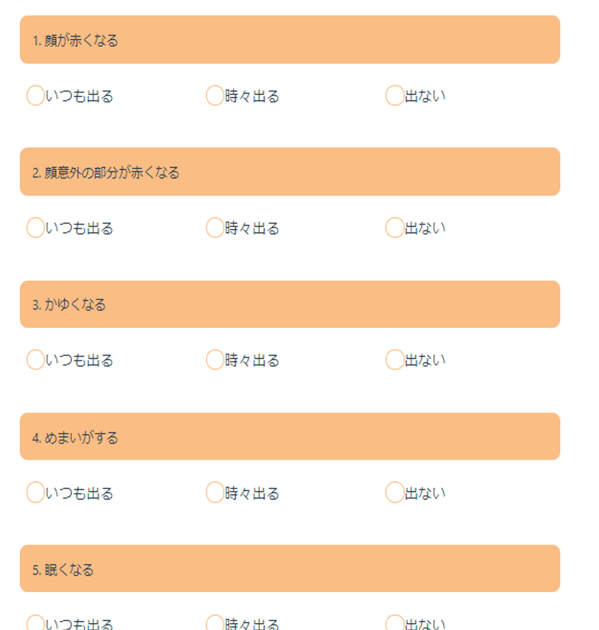
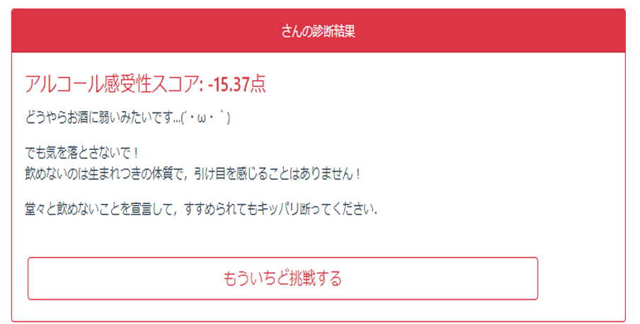

# 🍺 Description


たったの13項目の質問に答えると、-45~27の範囲でお酒の強さが得点化されます。
得点が０より大きければ酒豪、マイナスなら下戸と判定されます。

# 🍺 App URL
https://alcohol-test.netlify.app/

# 🍺 Overview
## 質問画面


## 結果画面


# 🍻 Project setup
## プロジェクトへの参入

```
git clone https://github.com/SUGIZAKI19/AlcoholToleranceTest
```

## npm 持ってない人向け
1.  npmのインストール
    ```
    npm install
    ```

2.  ローカルサーバーの立ち上げ
    ```
    npm run serve
    ```

3.  Compiles and minifies for production
    ```
    npm run build
    ```
